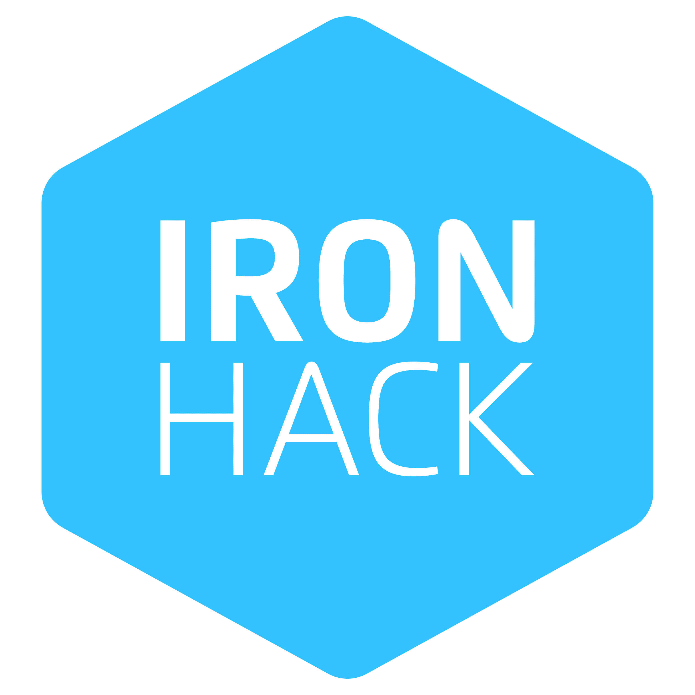

# Circle Agency

## Mid Term Project from Ironhack FrontEnd Bootcamp

This is the first project done in Frontend IronHack Bootcamp after the first two weeks. The assignment was to duplicate a specific website, in this case the website was this one: <a href="https://circle-agency-35d27e.webflow.io/">circle.</a>

The project consisted in cloning the "main page", the "contact us" page and the "project page" and making it responsive for mobiles and desktop. Also we had to import the projects section information from a fake API.

Also we had to afront different JavaScript challenges like:

<ul>
<li>Get calls</li>
<li>Post calls</li>
<li>Hamburger menu</li>
</ul>

## Team

We did this project in pair so we could learn and practice how to do the Merge in gitHub and afront all this together.

We are Balma Rosas Beltran and Noemí Silvestre Ameijide 😊

## Technologies

The technologies used to make this website are:

<ul>
<li>HTML</li>
<li>CSS</li>
<li>JavaScript</li>
<li>GitHub</li>
</ul>

Made with ❤️ and ☕️
 
👩🏻‍💻 by Balma and Noemí 👩🏻‍💻
